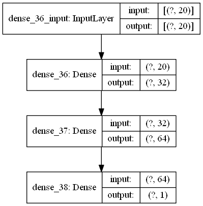

<h2 align=center> Forecasting the Power Generated by a Solar Plant </h2>

Solar power is a free and clean alternative to traditional fossil fuels.

However, nowadays, solar cells' efficiency is not as high as we would like, so selecting the ideal conditions for its installation is critical in obtaining the maximum amount of energy out of it.

We want to predict the power output for a particular array of solar power generators, knowing some environmental conditions.

Solar power forecasting is  very usefull in smooth operation and control of solar power plant. Generation of energy by a solar panel or cell depends upon the doping level  and design of solar PV array but  the main factors are the amount of solar radiation falling on the panel, environmental factors like atmospheric temperature and humidity  and  dust present on the panels .  These factors are naturally variable  and hence the output of solar cell  directly depend on it. Also, the solar irradiance as well as all the above-mentioned factors are variable throughout the day. Hourly average or average at a particular interval of time of these parameters received is measured for better prediction of output of a PV module and thus a solar power plant. The lower  the  sampling rate better will be the predication.

**About DATA**
* distance-to-solar-noon, in radians.
* temperature, daily average temperature, in degrees Celsius.
* wind-direction, daily average wind direction, in degrees (0-360).
* wind-speed, daily average wind speed, in meters per second.
* sky-cover, in a five-step scale, from 0 to 4, being 0 totally clear and 4 completely covered.
* visibility, in kilometers.
* humidity, in percentage.
* average-wind-speed-(period), average wind speed during the 3-hour period de measure was taken in, in meters per second.
* average-pressure-(period), average barometric pressure during the 3-hour period de measure was taken in, in mercury inches.
* power-generated, in jules for each 3-hour period.

Dependencies
---------
* Python 3.8
* Pandas 
* Tensorflow 2.2
* Keras
* Matplotlib
* Seaborn
* Numpy

Model Architecture
--------

  
  

Results
-------

  
  

- lasso regressor feature importance

| Evaluation Parameter  | Value  |
| --------- | -------|
|R2 Score of Whole Data Frame	|0.881888|
|R2 Score of Training Set|	0.921727|
|R2 Score of Test Set|	0.767884|
|Mean of Test Set|	1204.179810|
|Standard Deviation of Test Set	|930.158020|
|Relative Standard Deviation	|0.772441|

Refrences
------
- [Neural Designer](https://www.neuraldesigner.com/)
- [Get Data](https://www.neuraldesigner.com/files/datasets/solarpowergeneration.csv)
